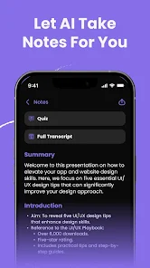

<h1 align="center">🚀 Learnify</h1>

  <b>🌐 AI Note-Taker Landing Page</b>  
  Study Smarter With AI 🧠✨

  ⚡ This project is a <b>front-end landing page</b> designed to showcase an AI-powered note-taking application.

---

## 🎯 About This Project

This is a **landing page UI project** built to present the idea of an AI Note-Taker App.

It focuses on:
- Clean design 🎨  
- User experience 💡  
- Product presentation 🚀  

---

## 🌟 What This Landing Page Includes

- 🧠 Hero Section (AI-focused tagline)  
- 🖼️ Visual content & illustrations  
- 📖 Detailed product description  
- ✨ Feature highlights  
- 🚀 Call-to-action (Download section)  

---

## 💻 Tech Used

- HTML  
- CSS  

---

## 🖼️ Preview

  

---

## 🚀 Purpose

This project was created to:
- Practice frontend development  
- Build a product-style landing page  
- Showcase UI/UX skills  

---

## 🔮 Future Scope

- Convert into full-stack app  
- Add real AI features  
- Deploy live version  

---

## 👨‍💻 Author

**Vanya**  
🔗 https://github.com/Vanya-tech279  

---

🔥 Frontend Landing Page Project 🔥

